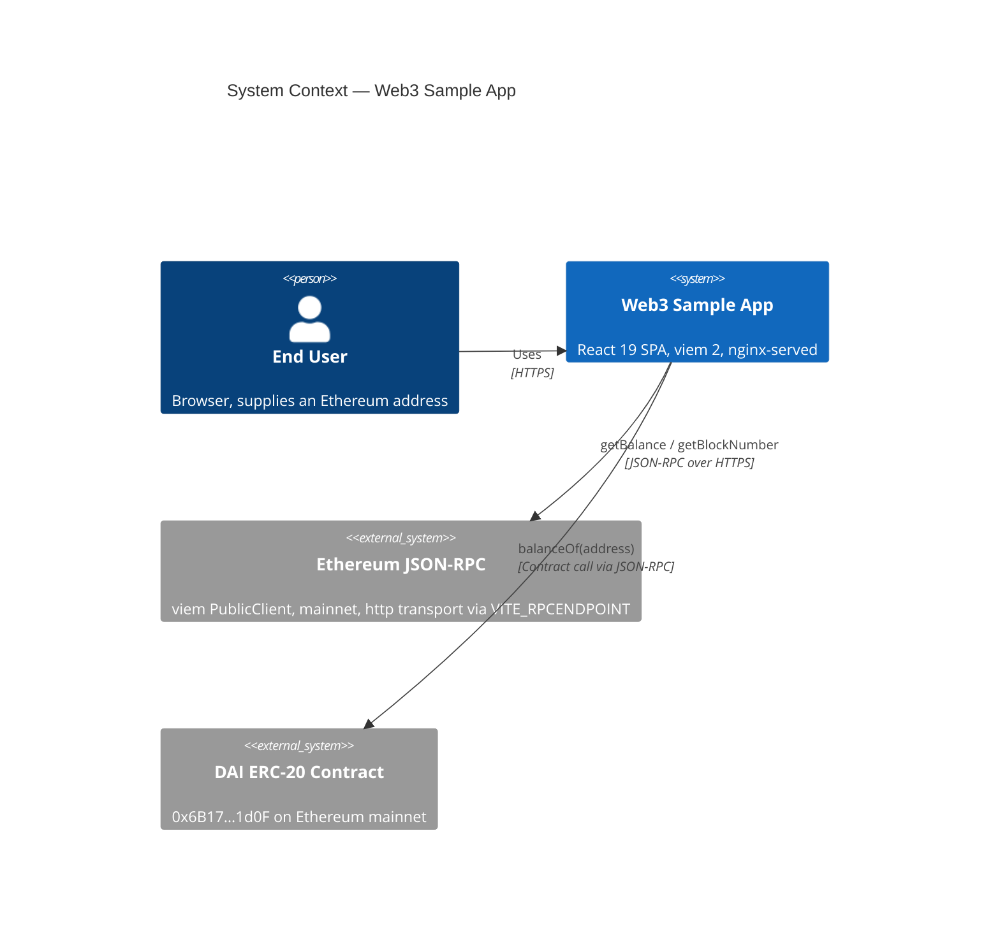
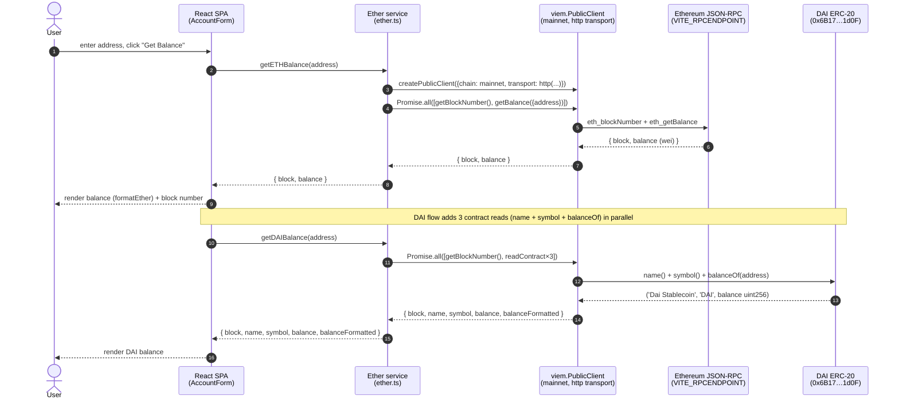
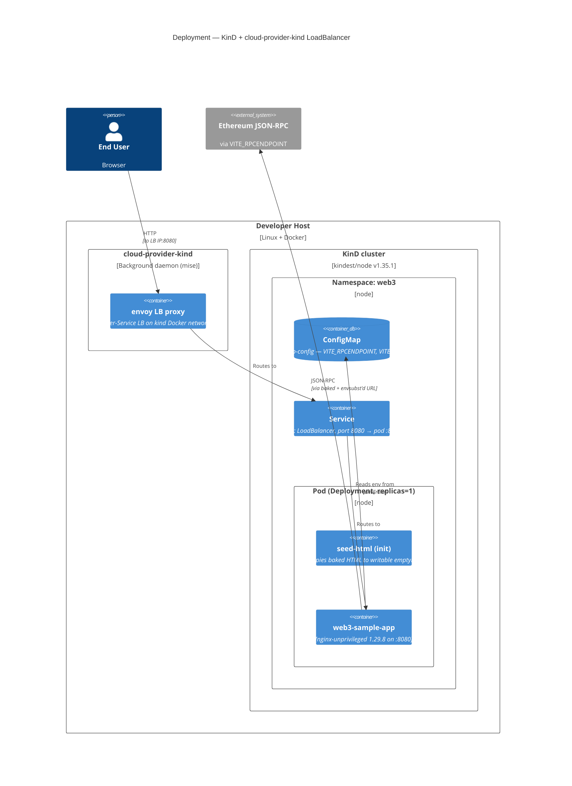

[](https://github.com/AndriyKalashnykov/web3-sample-app/actions/workflows/ci.yml)
[](https://hits.sh/github.com/AndriyKalashnykov/web3-sample-app/)
[](https://opensource.org/licenses/MIT)
[](https://app.renovatebot.com/dashboard#github/AndriyKalashnykov/web3-sample-app)

# Web3 Sample App

Reference React SPA that queries ETH and DAI ERC-20 balances from the Ethereum blockchain via viem, packaged as a non-root nginx container and deployable to Kubernetes.

| Component | Technology |
|-----------|------------|
| Language | TypeScript 6.x (`moduleResolution: "bundler"`) |
| Framework | React 19, react-router-dom 7 |
| Build tool | Vite 8 (oxc minifier, Rolldown manual chunks) |
| UI | MUI v9, Tailwind CSS v4 (`@tailwindcss/postcss`) |
| State | Redux Toolkit 2 (`createSlice`, typed hooks) |
| Web3 | viem 2 (`createPublicClient`, `http`, `readContract`, `parseAbi`) |
| i18n | i18next + react-i18next (English bundled) |
| Testing | Vitest 4, React Testing Library, jsdom |
| Container | Builder: `node:24.15.0-alpine`; runtime: `nginxinc/nginx-unprivileged:1.29.8-alpine` (port 8080, runs as UID 101) |
| Orchestration | Kubernetes (manifests under `k8s/`); local KinD via Makefile |
| CI/CD | GitHub Actions, Renovate (platform automerge) |
| Code quality | Prettier, hadolint, Trivy (fs+config), gitleaks |
| Tool versioning | mise (single source of truth in `.mise.toml`) |



## Quick Start

```bash
make deps       # install mise + all pinned tools (node, pnpm, hadolint, kubectl, kind, yq, trivy, gitleaks, act)
make install    # pnpm install
make build      # tsc + vite build
make test       # run unit tests
make run        # start dev server, then open http://localhost:8080
```

## Prerequisites

| Tool | Version | Purpose |
|------|---------|---------|
| [GNU Make](https://www.gnu.org/software/make/) | 3.81+ | Build orchestration |
| [Git](https://git-scm.com/) | latest | Version control + history (used by `gitleaks`) |
| [Docker](https://www.docker.com/) | latest | Container builds, KinD runtime, Mermaid lint |
| [curl](https://curl.se/) | latest | Bootstraps `mise` in `make deps` |
| [mise](https://mise.jdx.dev/) | latest | Manages every other tool (auto-installed by `make deps`) |

`make deps` installs [mise](https://mise.jdx.dev/) into `~/.local/bin` (no sudo) and then runs `mise install` against the pinned `.mise.toml` to provision: Node.js, pnpm, hadolint, kubectl, kind, yq, Trivy, gitleaks, act.

## Architecture

The SPA is a single React app served from a static nginx image. All blockchain calls happen in the browser against an external JSON-RPC endpoint configured at deploy time. There is no backend.

### Entry flow

1. `src/main.tsx` mounts `<App>` wrapped in MUI `ThemeProvider` + Redux `Provider`.
2. `src/App.tsx` renders the `Header`/`Footer` layout with `BrowserRouter`. Routes are defined in `src/router/index.ts` and lazy-loaded with `React.lazy` + `<Suspense>`.
3. The Ethereum service (`src/service/ether/ether.ts`) constructs a viem `PublicClient` against `VITE_RPCENDPOINT` (mainnet, `http` transport) and exposes `getETHBalance(address)` → `{block, balance}` and `getDAIBalance(address)` → `{block, name, symbol, balance, balanceFormatted}`. The DAI ERC-20 contract is hardcoded to its canonical mainnet address `0x6B17…1d0F` (no ENS lookup).
4. State lives in `src/store/` — Redux Toolkit slices (`counterSlice`, `commonSlice`) accessed through typed hooks (`useAppDispatch`, `useAppSelector`).

### Runtime env-var injection

`Dockerfile.prod` builds with placeholder env values, then `start-nginx.sh` runs `envsubst` against the served JS bundles at container startup so `VITE_RPCENDPOINT` can be set per-environment without rebuilding the image. The K8s `ConfigMap` in `k8s/cm.yaml` provides this value in cluster.

### Path alias

`@/` maps to `src/` — configured in both `tsconfig.json` (`paths`) and `vite.config.ts` (`resolve.alias`).

### Balance-query sequence



Source: [`src/service/ether/ether.ts`](src/service/ether/ether.ts) and [`src/components/AccountForm.tsx`](src/components/AccountForm.tsx).

### Deployment topology (KinD)



The `seed-html` init container copies the baked SPA bundle from the read-only image filesystem into a writable `emptyDir` mounted at `/usr/share/nginx/html`. The main container's `start-nginx.sh` then runs `envsubst` against the bundled JS (replacing the literal `$VITE_RPCENDPOINT` placeholder Vite baked at build time with the value from the ConfigMap) before nginx starts. This is what makes "build once, configure at deploy time" work despite `readOnlyRootFilesystem: true` on the main container.

## Testing

Four test layers, each with its own Makefile target, config, and CI job:

| Layer | Target | Files | Where it runs | What it covers |
|-------|--------|-------|---------------|----------------|
| Unit + Component | `make test` | `src/store/models/__tests__/`, `src/service/ether/__tests__/ether.test.ts`, `src/components/__tests__/` | jsdom (vitest, in-process) | Pure functions, Redux slices, mocked ether service, components rendered via `renderWithProviders` |
| Integration | `make integration-test` | `src/service/ether/__tests__/ether.integration.test.ts` | node (vitest, real network) | Ether service against the real `VITE_RPCENDPOINT` (block fetch, ETH/DAI balance, malformed-input negatives) |
| E2E — HTTP | `make e2e` | `e2e/e2e-test.sh` | KinD + cloud-provider-kind LoadBalancer | nginx routes (`/internal/isalive`, `/internal/isready`, `/publicnode` → 307, SPA fallback, missing asset 404) + verifies `start-nginx.sh` substituted `VITE_RPCENDPOINT` into served JS |
| E2E — Browser | `make e2e-browser` | `e2e/playwright.config.ts`, `e2e/account-form.spec.ts` | KinD + cloud-provider-kind + Playwright Chromium | AccountForm renders + real RPC roundtrip updates the displayed block number |

```bash
make test               # unit + component (~1s)
make test-watch         # watch mode
make test-coverage      # coverage report
make integration-test   # real-RPC integration (~5s, needs outbound HTTPS)
make e2e                # full HTTP suite against deployed nginx (~30s)
make e2e-browser        # Playwright browser e2e (~45s)
```

A valid Ethereum address for manual UI testing:

```text
0xeB2629a2734e272Bcc07BDA959863f316F4bD4Cf
```

## Build & Package

```bash
make build               # production bundle to ./dist
make image-build         # dev image (Node alpine + pnpm dev server)
make image-build-prod    # production image (nginx-unprivileged on 8080)
```

The production Dockerfile is multi-stage: `node:24.15.0-alpine` builder → `nginxinc/nginx-unprivileged:1.29.8-alpine`. Both Dockerfiles use `pnpm install --frozen-lockfile`, pin base images by SHA256 digest, and copy lockfiles before source for layer caching. The final image runs as non-root (UID 101) with `corepack`-provided pnpm.

## Deployment

### Local KinD cluster

Two-command bring up / tear down (compose-style):

```bash
make kind-up      # cluster + cloud-provider-kind + image + manifests; prints the LB URL when ready
make kind-down    # full teardown (cluster + cloud-provider-kind)
```

`make kind-up` is the canonical entry point — it chains `kind-create` → `kind-cloud-provider-start` → `image-build-prod` → `kind-deploy` → wait for the LoadBalancer IP, then prints `Stack is up — open http://<LB_IP>:8080`. The LoadBalancer IP comes from `cloud-provider-kind` (a sigs.k8s.io project that runs envoy proxies on the kind Docker network). No MetalLB / NodePort gymnastics required.

Granular targets (for debugging flows):

```bash
make kind-create                  # create cluster only (idempotent)
make kind-cloud-provider-start    # start cloud-provider-kind daemon
make kind-cloud-provider-stop     # stop cloud-provider-kind daemon
make kind-deploy                  # build prod image, load, apply manifests
make kind-redeploy                # rebuild + recreate deployment
make kind-undeploy                # remove workload only (cluster stays)
make kind-destroy                 # delete cluster + stop cloud-provider-kind
```

Manual access after `make kind-up`:

```bash
LB_IP=$(kubectl -n web3 get svc web3-sample-app -o jsonpath='{.status.loadBalancer.ingress[0].ip}')
curl "http://${LB_IP}:8080/internal/isalive"
xdg-open "http://${LB_IP}:8080"
```

`make e2e` does the LB-IP lookup automatically.

### From the public GHCR image

```bash
kubectl apply -f ./k8s --namespace=web3 --validate=false

service_ip=$(kubectl get services web3-sample-app -n web3 \
  -o jsonpath="{.status.loadBalancer.ingress[0].ip}")
xdg-open "http://${service_ip}:8080"

kubectl delete -f ./k8s --namespace=web3
```

The K8s ConfigMap (`k8s/cm.yaml`) provides `VITE_RPCENDPOINT` to the running pod; `start-nginx.sh` substitutes it into the served JS at startup.

## Available Make Targets

Run `make help` to see the full list. Grouped by purpose:

### Build & Run

| Target | Description |
|--------|-------------|
| `make build` | Build production bundle (tsc + vite) |
| `make run` | Start dev server on port 8080 |
| `make install` | Install NodeJS dependencies (uses `--frozen-lockfile` when `CI=true`) |
| `make clean` | Cleanup `node_modules/` and `dist/` |
| `make upgrade` | Upgrade pnpm dependencies |

### Testing

| Target | Description |
|--------|-------------|
| `make test` | Run unit + component tests (vitest, fast) |
| `make test-watch` | Run tests in watch mode |
| `make test-coverage` | Run tests with coverage report |
| `make integration-test` | Run integration tests (real RPC via `VITE_RPCENDPOINT`) |
| `make e2e` | Deploy to KinD + run curl-based e2e suite |
| `make e2e-browser` | Run Playwright Chromium browser e2e against deployed SPA |
| `make deps-playwright` | Install Playwright Chromium browser |

### Code Quality

| Target | Description |
|--------|-------------|
| `make lint` | Prettier check + hadolint on both Dockerfiles |
| `make format` | Prettier `--write` |
| `make vulncheck` | `pnpm audit --audit-level=moderate` |
| `make trivy-fs` | Trivy filesystem scan (vulns + secrets + misconfigs) |
| `make trivy-config` | Trivy IaC scan (k8s manifests + Dockerfiles) |
| `make secrets` | gitleaks scan over git history |
| `make mermaid-lint` | Validate Mermaid blocks via `minlag/mermaid-cli` |
| `make deps-prune` | Advisory: list unused npm dependencies |
| `make deps-prune-check` | CI gate: fail if unused dependencies exist |
| `make static-check` | Composite: lint + vulncheck + trivy-fs + trivy-config + secrets + mermaid-lint + deps-prune-check |
| `make check` | static-check + test + build (full local pipeline) |

### Docker

| Target | Description |
|--------|-------------|
| `make image-build` | Build dev Docker image |
| `make image-build-prod` | Build production Docker image (`Dockerfile.prod`) |
| `make image-run` | Run image on port 8080 |
| `make image-stop` | Stop the running container |
| `make docker-smoke-test` | Build prod image + boot + curl `/internal/isalive` (CI Gate 3 mirror) |
| `make dast` | Local DAST: smoke-test + ZAP baseline against `:8080`; cleans up |
| `make dast-scan` | Run ZAP baseline against an already-running smoke container |

### Kubernetes

| Target | Description |
|--------|-------------|
| `make kind-up` | Compose-style bring-up: cluster + cloud-provider-kind + image + manifests + wait + print LB URL |
| `make kind-down` | Compose-style teardown: workload + cluster + cloud-provider-kind |
| `make kind-create` | (granular) Create a local KinD cluster (idempotent) |
| `make kind-destroy` | (granular) Delete the local KinD cluster + stop cloud-provider-kind |
| `make kind-cloud-provider-start` | (granular) Start `cloud-provider-kind` in background |
| `make kind-cloud-provider-stop` | (granular) Stop `cloud-provider-kind` background process |
| `make kind-deploy` | (granular) Build prod image + create cluster + start cloud-provider-kind + apply manifests |
| `make kind-undeploy` | (granular) Remove workload (cluster + cloud-provider-kind stay) |
| `make kind-redeploy` | (granular) Same as kind-deploy but recreates the deployment |

### CI

| Target | Description |
|--------|-------------|
| `make ci` | Full pipeline: install + static-check + test + integration-test + build |
| `make ci-run` | Run the GitHub Actions workflow locally via [act](https://github.com/nektos/act) (e2e + dast skipped via `vars.ACT`) |
| `make ci-run-tag` | Run the workflow under act with a synthetic tag-push event (exercises the `docker` job + `dast`; cosign expected to fail under act, no OIDC) |

### Utilities

| Target | Description |
|--------|-------------|
| `make help` | List available tasks |
| `make deps` | Install mise + all pinned tools |
| `make deps-act` / `deps-hadolint` / `deps-k8s` / `deps-trivy` / `deps-secrets` | Aliases for `deps` (kept for explicit-intent recipes) |
| `make release` | Create and push a new tag (`vN.N.N`) |
| `make tag-delete TAG=v0.0.1` | Delete a tag locally and remotely |
| `make renovate-validate` | Validate Renovate configuration |
| `make cleanup-runs` | Delete workflow runs older than 7 days (keeps at least 5) |
| `make cleanup-images` | Delete untagged GHCR images (keeps 5 most recent) |

## CI/CD

GitHub Actions runs on every push to `main`, every tag `v*`, every pull request, and on manual dispatch. All actions are pinned to commit SHAs.

| Job | Triggers | Steps |
|-----|----------|-------|
| **static-check** | every event | `make install` + `make static-check` (lint, vulncheck, trivy-fs, trivy-config, secrets, mermaid-lint, deps-prune-check) |
| **test** | after static-check | `make test` (unit + component) |
| **integration-test** | after static-check | `make integration-test` (real-RPC integration suite) |
| **build** | after static-check | `make build`; uploads `dist/` artifact |
| **e2e** | after build + test (skipped under act) | KinD + cloud-provider-kind LoadBalancer + curl assertions — `make e2e` |
| **dast** | after build + test (skipped under act) | OWASP ZAP baseline scan against booted container; ZAP image cached |
| **docker** | after static-check + build + test, **tag push only** | Pre-push gates (Trivy image scan, smoke test) → multi-arch build + push → cosign keyless signing |
| **ci-pass** | always (after all above) | Aggregator gate; fails if any upstream job failed |

### Pre-push image hardening

The `docker` job runs the following gates **before** any image is pushed to GHCR. Any failure blocks the release.

| # | Gate | Catches | Tool |
|---|------|---------|------|
| 1 | Build single-arch image (`load: true`, linux/amd64) | Build regressions on the runner architecture | `docker/build-push-action` |
| 2 | **Trivy image scan** (CRITICAL/HIGH blocking) | CVEs in base image, OS packages, build layers, secrets, misconfigs | `aquasecurity/trivy-action` |
| 3 | **Smoke test** | nginx fails to boot or `/internal/isalive` doesn't respond | `docker run` + `curl` |
| 4 | Multi-arch build + push (`linux/amd64,linux/arm64`) | Publishes for both architectures with `cache-from: type=gha` (~95% cache hit from Gate 1) | `docker/build-push-action` |
| 5 | **Cosign keyless OIDC signing** | Sigstore signature on the manifest digest (Rekor transparency log) | `sigstore/cosign-installer` + `cosign sign --yes <tag>@<digest>` |

The parallel `dast` job adds:

| Gate | Catches | Tool |
|------|---------|------|
| **OWASP ZAP baseline** | Missing security headers, misconfigs, info leaks (`-I` = WARN-only; FAIL blocks; report uploaded) | `make dast-scan` |

`provenance: false` and `sbom: false` keep the OCI image index free of `unknown/unknown` attestation entries so the GHCR Packages "OS / Arch" tab renders. Cosign signing alone provides supply-chain verification.

Verify a published image's signature:

```bash
cosign verify ghcr.io/andriykalashnykov/web3-sample-app:<tag> \
  --certificate-identity-regexp 'https://github\.com/AndriyKalashnykov/web3-sample-app/.+' \
  --certificate-oidc-issuer https://token.actions.githubusercontent.com
```

Tool versions for CI come from `.mise.toml` via [`jdx/mise-action`](https://github.com/jdx/mise-action) — no version drift between local and CI.

### Cleanup workflows

| Workflow | Schedule | Purpose |
|----------|----------|---------|
| `cleanup-images.yml` | Weekly (Sunday 03:00 UTC) | Delete untagged GHCR images, keep 5 most recent (calls `make cleanup-images`) |
| `cleanup-runs.yml` | Weekly (Sunday 00:00 UTC) | Delete workflow runs older than 7 days + caches from merged branches (calls `make cleanup-runs`) |

### Run CI locally

```bash
make ci-run
```

Uses [act](https://github.com/nektos/act) with a randomized artifact-server port and an ephemeral artifact directory to avoid colliding with concurrent invocations.

### Dependency management

[Renovate](https://docs.renovatebot.com/) manages dependency updates with platform automerge enabled. Updates automerge after CI passes; major updates wait 3 days for stability. Tool versions in `.mise.toml` are tracked by Renovate's `mise` manager (and the `# renovate:` inline annotations on aqua: pins).

## Release

1. Update the version constant in [`src/components/Layout.tsx`](./src/components/Layout.tsx) (search for `const Version =`) so the in-app About page displays the new tag.
2. Run `make release` and respond to the prompts:
   ```bash
   make release
   ```
   The target validates the semver format (`vN.N.N`), writes `version.txt`, commits both files, tags the commit, and pushes both the tag and the branch. The `docker` CI job then builds and publishes the multi-arch image to GHCR.
3. To delete a tag (locally and on the remote):
   ```bash
   make tag-delete TAG=v0.0.1
   ```
